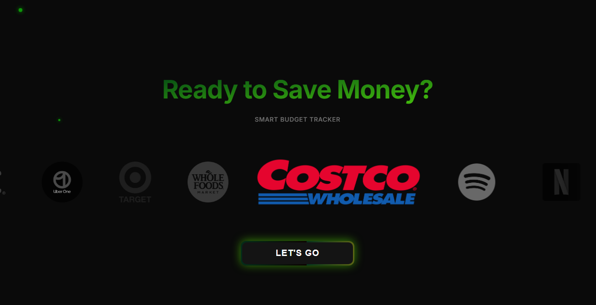

# 💰 BudgetFixer (Smart Budget Tracker)

An intelligent, microservices-based financial tracking application that utilizes OCR (Optical Character Recognition) to scan receipts and automatically categorizes expenses using a custom logic engine.



## 🚀 Features

* **Receipt Scanning:** Upload receipts to extract line items and prices automatically using Tesseract OCR.
* **Microservices Architecture:** Decoupled services for Frontend, OCR Processing, and Business Logic.
* **Smart Categorization:** Items are analyzed and assigned categories (Groceries, Tech, Entertainment) with manual override capabilities.
* **Real-time Budgeting:** Dynamic progress bars and limit tracking.
* **Containerized:** Fully Dockerized for one-command deployment.

## 🛠️ Tech Stack

* **Frontend:** React.js, CSS3 (Glassmorphism UI), Axios.
* **Orchestrator Service:** Python, Flask, PyTesseract (OCR), gRPC Client.
* **Logic Service:** Go (Golang), gRPC Server (Protocol Buffers).
* **Infrastructure:** Docker, Docker Compose.

## 🏗️ Architecture

The application follows a distributed microservices pattern:

1.  **Frontend (React):** Handles user interaction and visualization.
2.  **Ingestion Service (Python):** Receives the image, cleans the noise, extracts text via OCR, and acts as the gRPC Client.
3.  **Audit Engine (Go):** The high-performance logic core. It receives raw item data via gRPC, applies business rules, assigns categories, and returns structured data.

## 📦 Getting Started

This project is fully containerized. You do not need to install Python, Go, or Node.js locally. You only need **Docker**.

### Prerequisites
* [Docker Desktop](https://www.docker.com/products/docker-desktop/) installed and running.

### Installation

1.  **Clone the repository:**
    ```bash
    git clone [https://github.com/YOUR_USERNAME/AiBudgetFixer.git](https://github.com/YOUR_USERNAME/AiBudgetFixer.git)
    cd AiBudgetFixer
    ```

2.  **Run with Docker Compose:**
    Open your terminal in the root folder and run:
    ```bash
    docker-compose up --build
    ```

3.  **Access the App:**
    Open your browser and visit: `http://localhost:3000`

## 🔮 Future Roadmap

* [ ] Integration with Gemini AI / OpenAI for advanced item recognition.
* [ ] Database persistence (PostgreSQL) for user history.
* [ ] User Authentication (OAuth2).
* [ ] Data visualization charts.

## 📄 License

Distributed under the MIT License. See `LICENSE` for more information.
